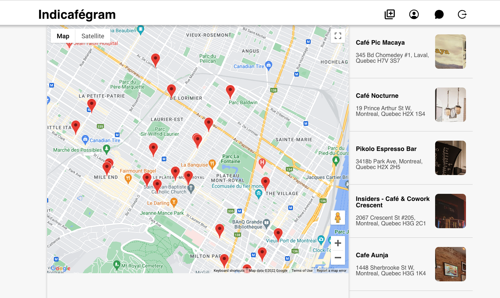
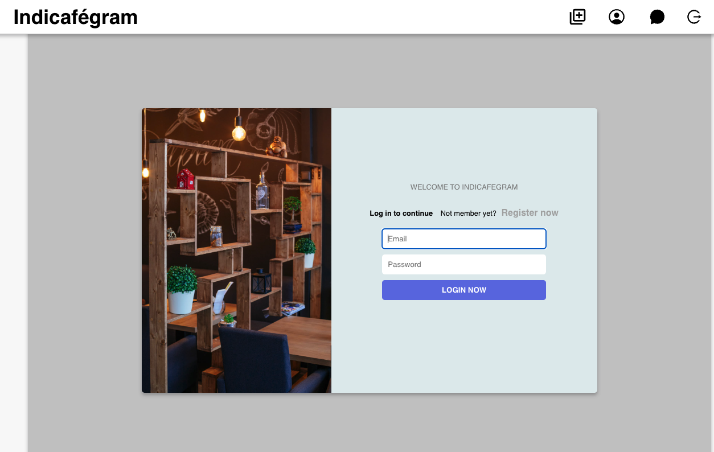
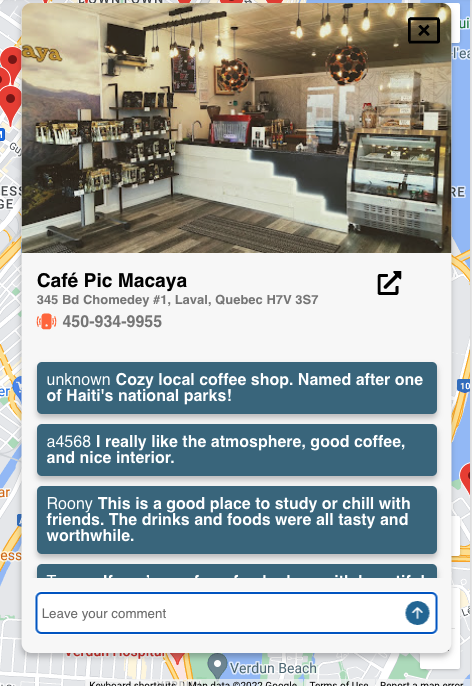
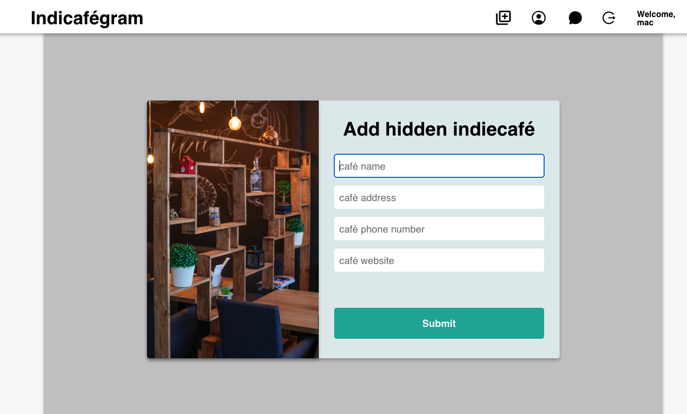
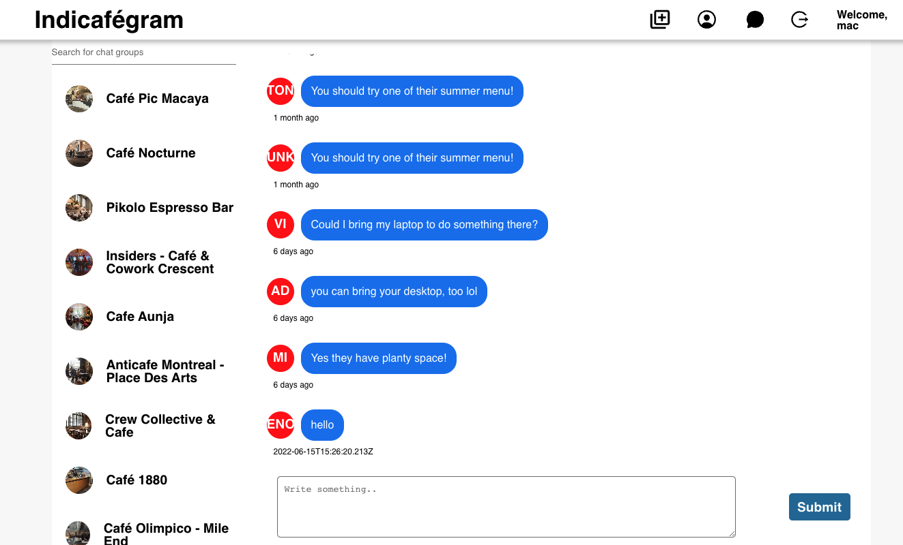
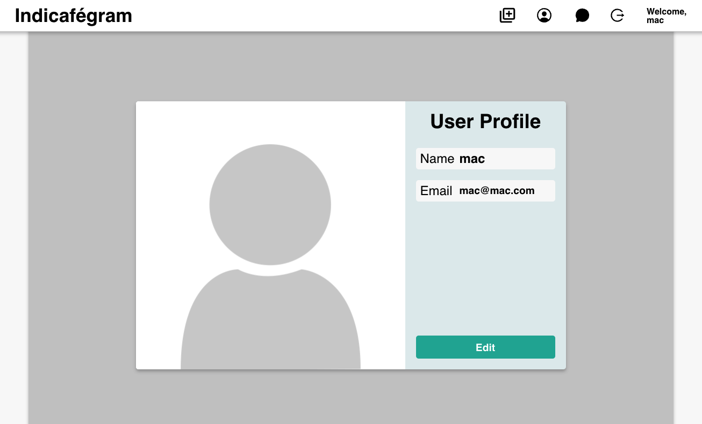

# project-indiecafegram

"indiecafegram" is a location based web service for crazy coffee lovers. It offers user the locations of their favorite independent coffee shops, reviews and chat service.

We introduce coffee lovers to a new coffee shop to try and provide a platform for betweent people who has the same tasts to become frineds.

## ☕️ Let's enjoy the best cup of coffee

---

# Structure

## Client

> react-google-map/api
>
> > using google map api

> firebase - only authenticatin not database

## Server

> mongoDB

## Log in or Sign up

> firebase authenticatoin

> mongoDB to save user info

## Home - google map, sidebar with cafe list

> Map with markers of coffee shop locations

> Café list in sidebar

> Café detail page & Café reviews
> 

> Add hidden indie café
> 

## Group Chat and make a friend in your favorite cafe

> Group chat list in Sidebar

> Chat box

## Profile and Edit profile

## Log out

## on the next version..

> socket.io

> improve google maps utilization

### - upgrage user profile

#### avatar and more info

### - implement more APIs

#### weather, instagram, youtube, etc..
